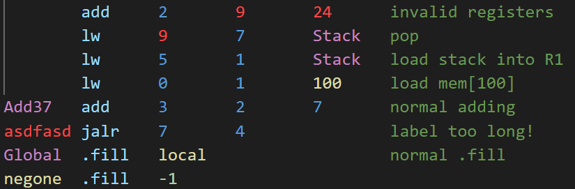
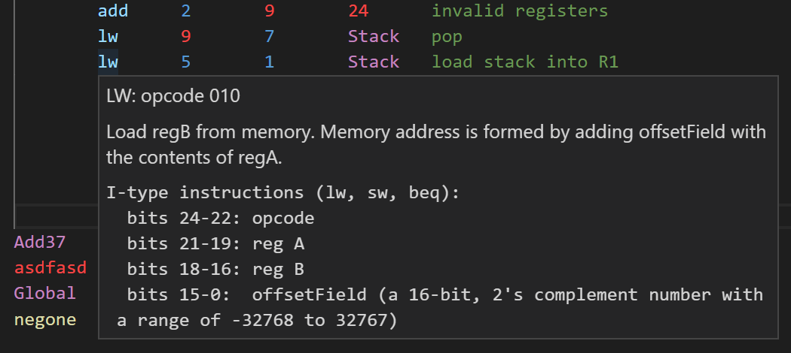

# lc2k README

## Features

### Syntax Highlighting

* Easier to read
* Detects simple errors
  
  

### Opcode hover help

* Quick reference to what opcodes do on hover
  
  

### Formatter

* Replaces whitespace with tabs (no option for spaces)
* Sets file specific settings for lc2k
  * Defaults, descriptions of each are given in vscode documentation.
    ```json
    "[lc2k]": {
      "editor.insertSpaces": false,
      "editor.tabSize": 8,
      "editor.autoIndent": false,
      "editor.formatOnSave": true,
      "files.trimFinalNewlines": true,
      "files.insertFinalNewline": true
    }
    ```
* Has a few settings:
  * format.enable
    * Enable the formatter.
  * "[lc2k]": { .... "files.trimFinalNewlines": true,  "files.insertFinalNewline": true}
    * When enabled(default), will add a newline at the end of the file so you don't get "line too long" errors.
    * You can disable either of these, but that's not reccomended.
  * format.irTypeOffset, format.jTypeOffset, format.oTypeOffset, format.fillOffset
    * Changes the tab offset for comments for given types.
    * null will not indent or format the comments.

------------------------------------------------------

## Release Notes

### 0.2.2

* Added new file extension
* Updated dependencies

### 0.2.1

* Added formatter

### 0.1.*

* Hover help on opcode
* Much imporoved syntax highlighting
* Updated readme

### 0.0.*

* Basic features working, simple regex higlighting


## Building for Dev - basic notes

On nixos, sorry! but you should be able to just install node in some other way and everything else will be the same

```bash
nix-shell -p nodejs_20
```

fix any dependances etc
In the shell

```bash
git clone git@github.com:violetbp/lc2k.git
cd lc2k
npm install 
code . 
```

f5 to run and test

#### Publishing

`npm install @vscode/vsce`
Delete the line added to dependances in package.json (should be empty)
`vsce package`
`vsce publish`